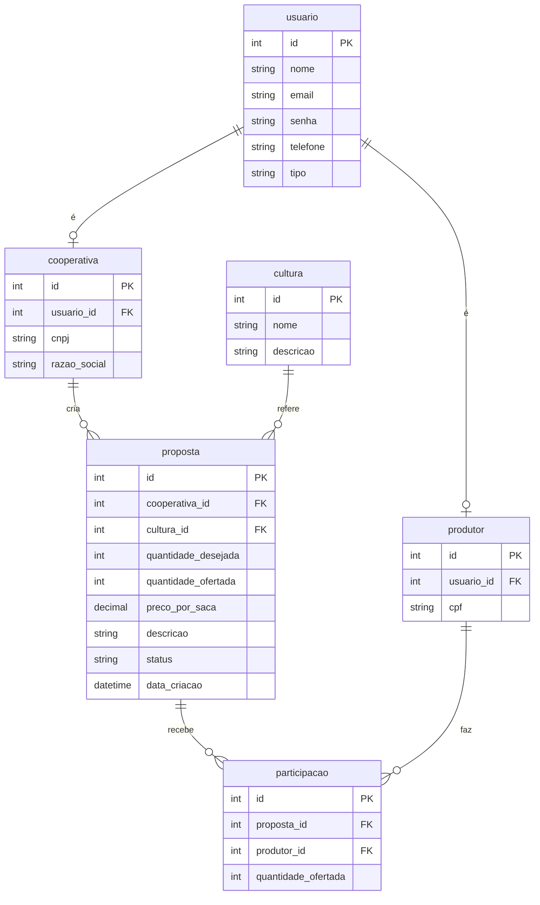

# Modelo de Banco de Dados — PlantaJunto

Modelo conceitual/lógico do sistema PlantaJunto. Embora esta etapa utilize armazenamento local (sem backend), o modelo abaixo descreve a estrutura de dados completa prevista para o projeto, servindo de base para a entidade **Proposta** implementada no CRUD.

## Entidades e Atributos

### usuario
Representa qualquer pessoa cadastrada (produtor ou cooperativa).

| Atributo | Tipo | Descrição |
|---|---|---|
| id (PK) | inteiro | Identificador único |
| nome | texto | Nome do usuário |
| email | texto | E-mail (único) |
| senha | texto | Senha (armazenada com hash) |
| telefone | texto | Telefone de contato |
| tipo | texto | "produtor" ou "cooperativa" |

### produtor
Dados específicos de um usuário do tipo produtor.

| Atributo | Tipo | Descrição |
|---|---|---|
| id (PK) | inteiro | Identificador único |
| usuario_id (FK) | inteiro | Referência a `usuario` |
| cpf | texto | CPF do produtor |

### cooperativa
Dados específicos de um usuário do tipo cooperativa.

| Atributo | Tipo | Descrição |
|---|---|---|
| id (PK) | inteiro | Identificador único |
| usuario_id (FK) | inteiro | Referência a `usuario` |
| cnpj | texto | CNPJ da cooperativa |
| razao_social | texto | Razão social |

### cultura
Tipo de grão negociado (soja, milho, trigo etc.).

| Atributo | Tipo | Descrição |
|---|---|---|
| id (PK) | inteiro | Identificador único |
| nome | texto | Nome da cultura |
| descricao | texto | Descrição opcional |

### proposta  *(entidade do CRUD implementado)*
Proposta de compra criada por uma cooperativa.

| Atributo | Tipo | Descrição |
|---|---|---|
| id (PK) | inteiro | Identificador único |
| cooperativa_id (FK) | inteiro | Cooperativa que criou a proposta |
| cultura_id (FK) | inteiro | Cultura desejada |
| quantidade_desejada | inteiro | Quantidade total de sacas desejada |
| quantidade_ofertada | inteiro | Quantidade já ofertada pelos produtores |
| preco_por_saca | decimal | Valor oferecido por saca |
| descricao | texto | Detalhes da proposta |
| status | texto | Aberta / Fechada / Cancelada |
| data_criacao | data/hora | Data de criação da proposta |

### participacao
Adesão de um produtor a uma proposta (relacionamento N:N entre produtor e proposta).

| Atributo | Tipo | Descrição |
|---|---|---|
| id (PK) | inteiro | Identificador único |
| proposta_id (FK) | inteiro | Referência a `proposta` |
| produtor_id (FK) | inteiro | Referência a `produtor` |
| quantidade_ofertada | inteiro | Quantidade de sacas ofertada pelo produtor |

## Relacionamentos

- **usuario 1 — 1 produtor**: um usuário do tipo produtor possui um registro em `produtor`.
- **usuario 1 — 1 cooperativa**: um usuário do tipo cooperativa possui um registro em `cooperativa`.
- **cooperativa 1 — N proposta**: uma cooperativa pode criar várias propostas.
- **cultura 1 — N proposta**: uma cultura pode estar em várias propostas.
- **proposta 1 — N participacao**: uma proposta recebe várias participações.
- **produtor 1 — N participacao**: um produtor pode participar de várias propostas.
- Assim, **produtor N — N proposta** através da entidade associativa `participacao`.

## Diagrama Entidade-Relacionamento

> O diagrama acima está em sintaxe **Mermaid**, que é renderizada automaticamente pelo GitHub. Também pode ser recriado no Draw.io / DBDiagram.io conforme as ferramentas previstas na Etapa 1.
